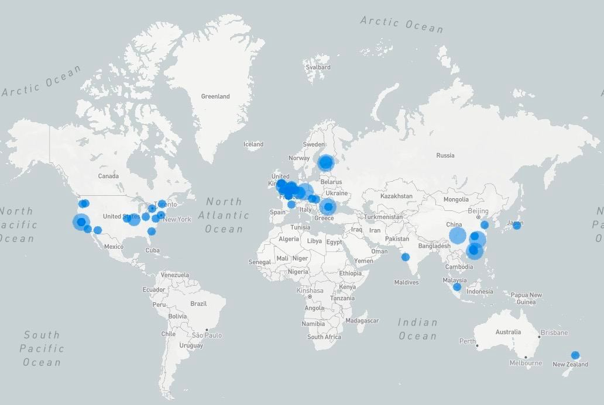
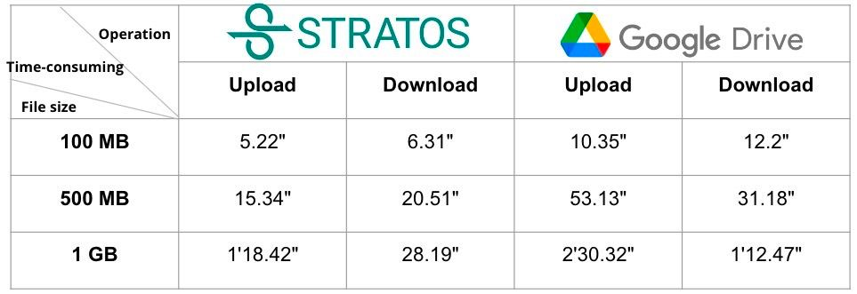

# Stratos X DeepCoin AMA Telegram 1.12.2023

## Welcomes

<claire>Beanycrow</claire>

Ladies and gentlemen, I welcome everyone to the AMA event in the Deepcoin English community. I am today's host Beanycrow|Deepcoin.

Let’s have a little introduction into Deepcoin.

Deepcoin, established in November 2018, is a prominent player in the blockchain industry. Founded by senior practitioners in the blockchain field and former executives of renowned internet companies and financial institutions, Deepcoin has garnered immense recognition within a short period. With over 3 million registered users across nearly 30 countries and a cumulative trading volume surpassing US $1 trillion, Deepcoin has emerged as a leading platform for cryptocurrency derivatives enthusiasts around the world.

Today, we are honored to have representatives from the Stratos Network here to share information about their project. Let's give them a warm welcome!

<bin>Bin</bin>

Thank you to have me today, I am Bin Zhu, founder of Stratos network.

<claire>Beanycrow</claire>

Our Guest for today is Bin Zhu, the founder and CEO of Stratos Network, a Web3 infrastructure startup. He has over 20 years of experience in software development across multiple platforms and technologies. At Stratos, Bin is leading his team of experts to build the next generation of decentralized data mesh which enables the use of blockchain technology across traditional and future industries. 

Before founding Stratos, Bin built MindGeek's big data ecosystem, leading a team on how to handle petabytes of big data for increased revenue. A tech entrepreneur at heart, Bin also co-founded Faimdata, a company providing AI solutions to identify the true single customer view.

Stratos has recently announced its successful integration with Polygon’s Solution Provider Network (SPN), a significant move towards fortifying decentralized infrastructure. This new collaboration aims to streamline connections between developers and critical infrastructure elements like oracles, bridges, RPC providers, and wallets, expediting dApp development and deployment. 

Stratos, committed to empowering Web3 developers, seeks to enhance decentralized storage efficiency by leveraging its expertise within Polygon’s dynamic ecosystem. The collaboration aspires to bolster accessibility, scalability, and efficiency in decentralized data storage, laying the groundwork for a more resilient web3 infrastructure.

---

## Introduction

<claire>Beanycrow</claire>

Could you please tell us more about your experiences and Stratos Network?

<bin>Bin</bin>

My name is Bin Zhu, As the founder of Stratos, I have over 20+ years of experience in software development across multiple platforms and technologies. Previously, I was the cloud team founder of MindGeek, where I built the complete big data ecosystem and led the entire team to provide data services to more than 100 million users per day across all the countries in the world.

I was also technical cofounded of Faimdata, an AI company providing consumer data intelligence solutions via computer vision for retailer customers. With experience working across the generations of technology innovations, I am leading the Stratos team to build the Stratos Network that enables the uses of blockchain technology across industries.

Stratos is a decentralized infrastructure project which contains blockchain (mainnet), decentralized storage (mainnet), decentralized database (Todo) and decentralized computation (Todo).

Stratos is a solid infrastructure for the entire blockchain industry in a decentralized manner. The user and developers can combine the 4 different services together to customize their product. 

The goal of Stratos is to be the foundation (Decentralized Cloud) of the Blockchain industry and help the blockchain industry to get rid of centralized Cloud service. 

As an infrastructure project than a consumer project, so it is closer ToB than ToC. So basically, user will use many applications which are built on top of Stratos. At the same time, Stratos team will also implement Stratos product base on Stratos infrastructure.

Stratos believes that not only the blockchain industry, but also in fact traditional industries need decentralized solutions. Stratos decentralized CDN, decentralized database and decentralized computation are all required by the traditional industries as well. Therefore, Stratos will form a closed loop within the blockchain industry, and at the same time, it will help the blockchain industry to open a window so that the blockchain can be better used by the traditional industry. More applied business scenarios will make the blockchain industry even stronger.

---

## Technological advantages

<claire>Beanycrow</claire>

What are your ways of scaling and developing your project in such a competitive time. And what are your technological advantages over your competitors?

<bin>Bin</bin>

This is a great question, I will answer it from several different points.

1. Stratos team has very valuable experience in traditional business, we know how to implement and deliver decent products to the clients.

2. Distributed system and decentralized network are different, but lots of good knowledge is transferable, which can help Stratos team to avoid the wrong technical decisions.

3. Economic and Consensus side,
In the traditional business, capacity is the way to measure the value or reward, for example, a bigger truck can transport more goods than a small one, so it can earn more. 
But in the Internet time, capacity is not an efficient way to measure the value any more. More traffic, more eyeball, more attention, more advertiser profit. No any internet companies mention they are the biggest one who own the most data, they only tell the market how much traffic they have per day per hour. 

So in the Internet industry, Storage is not the measurement of value, but the traffic is. So Stratos unique "Proof of Traffic" is the core of Stratos network which is the power engine to push Stratos to the MOON.

---

## Token value

<claire>Beanycrow</claire>

The value of a cryptocurrency is constantly changing. What will be the strategies for $STOS token to maintain an uptrend value?

<bin>Bin</bin>

Nice question.
$STOS token will capture the value based on the traffic is generated.

Like the internet company, more traffic generates more revenue for the internet company, meanwhile, the company pays for the cloud or data centre for the bandwidth/computation/storage.

$STOS is the payment token for the user and reward token for the miner. When the business user needs to pay more based on the traffic. The miner gets the certain $STOS in each 10 minutes, when traffic getting high in each 10 minutes, actually the value of $STOS is risen. This is the way $STOS token to maintain an uptrend value.

---

## Benefits of HODLing

<claire>Beanycrow</claire>

What profits will be gained if user hold $STOS tokens? and do you offer passive stable coin income to all $STOS token holders?

<bin>Bin</bin>

Holder can stake $STOS via Stratos wallet for the staking reward, the current APR is 8.19% now.

You can just check the APR in the real time via Stratos explorer.

<a href="https://explorer.thestratos.org/stratos" target="_blank">https://explorer.thestratos.org/stratos</a>

---

## Stratos and Deepcoin

<claire>Beanycrow</claire>

STOS has listing spot and futures trading on the Deepcoin exchange. What does this mean for the STOS project and community?

<bin>Bin</bin>

We hope listing on Deepcoin can benefit both Deepcoin community and Stratos community. Let communities who are interested in Stratos could invest $STOS easier and bring more exposure to Stratos project.

---

## Usecases

<claire>Beanycrow</claire>

What specific use cases and applications have been developed or tested on the Stratos platform, and how have they performed? 

<bin>Bin</bin>

Stratos mainnet is just launched 2 months ago, there are 367 nodes online across 16 countries participates Stratos network, the storage capacity is around 3 PB.

You can see the network is pure decentralized, anyone store the data to Stratos network, your data is stored safely everywhere in the world. In this case, there is no one can delete your data and ban your account.

Meanwhile, you always be the owner of your data, I would like to say 

"Not your key, not your coin", in Stratos network, "Not your key, not your content"

Because of the nodes are decentralized, Stratos network storage service performance is the fastest compare to any other decentralized storage projects, even better than Google Drive.

Stratos network could provide “Edge storage” service, allowing users to access the data as closer as possible to reduce the access latency.

---

## Challenges

<claire>Beanycrow</claire>

Most of the questions people had during the AMA asked about the strengths of the Project. So at this time, can we talk about your difficulties and challenges? Have you faced any major problems in creating your project so far?

<bin>Bin</bin>

We do, during the project implementation, and even after we launched the mainnet, we still encountered some network issues.

Such as 

1. the network bandwidth is not stable
2. some network access is blocked by firewall
3. ADSL network uploading and downloading bandwidth is not balanced. 
4. The server specification is not qualified.

When such things happen, the team always prioritize the work on it and making the network availability is the most important thing to do for the team.

<claire>Beanycrow</claire>

Thank you for providing so much clarity

Next, we’re going to have free Q&A time for our community members.
Now users can ask questions they have about Stratos. 

---

## Stratos and NFTs

<claire>Ade Rachmansyah</claire>

Staking, NFT is very hottest, do you think you will apply NFT technology to your products in the achieved future?

<bin>Bin</bin>

Yes, NFT need storage, most NFT projects we had conversation with, they use AWS or Google storage, we can help them to migrate the valuable digital asset from centralized storage to Stratos storage.

---

## Storage size

<claire>Matt</claire>

How much storage space has been allocated and utilized on the Stratos network since its launch, and are there any projections for its expansion in the near future?

<bin>Bin</bin>

There is around 3PB storage avaiable since we launched mainnet.

---

## Significance of Web3 infra

Could you elaborate on the significance of integrating Stratos's decentralized storage expertise within the broader context of Web3 infrastructure development?

<bin>Bin</bin>

One reason that Web2 is so successful because Web2 is backed by super solid centralized infra or public cloud as the foundation. 

But for Web3, most Dapp and even lots of public blockchain are fully depended on centralized infra or public cloud as well, which is the most problems for the entire Web3 industry. 

So the goal of Stratos to have a reliable decentralized infra for Web3 and let the developer community to migrate all the blockchain and Dapps services from centralized platform to decentralized platform.

---

 