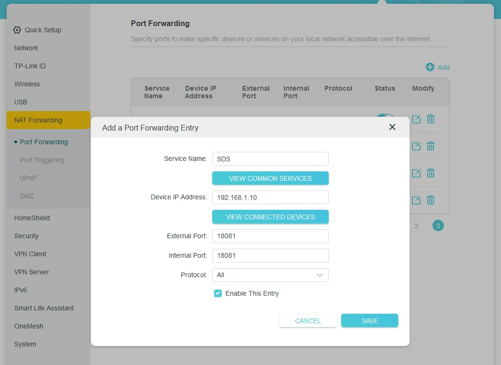

<small> Last update: March 12, 2023</small>

<center><iframe width="560" height="315" src="https://www.youtube.com/embed/d3SQmBMX2zc" title="YouTube video player" frameborder="0" allow="accelerometer; autoplay; clipboard-write; encrypted-media; gyroscope; picture-in-picture; web-share" allowfullscreen></iframe></center>

!!! info
    The newest Stratos chain version is Tropos-5 and after the upgrade, everything has been deleted except for the rewards you received if you ran a SDS node on Tropos-4.

    SDS node had a lot of changes so if you were running a SDS node on Tropos-4, the best way to upgrade is to start a fresh install.

    Old wallets can't be used due to compatibility changes so you will need to create a new wallet. You can still withdraw your rewards from Tropos-4.

## Rquirements

Running a SDS node requires the following resources:

- a linux server with ssh access
- proper port forward if you are behind a router 
- open port if firewall is active
- server should have a decent configuration: 

    | Type | CPU | RAM | Storage | Bandwidth | Stake |
    | ---- | --- | --- | ------- | --------- | ----- |
    | TIER 1 | 8 Cores[¹](#), 2.5GHz[²](#) | 16 GB | 4 TB | Up: 50Mbps Down: 100Mbps | 800 STOS |
    | TIER 2 | 16 Cores[¹](#), 2.5GHz[²](#) | 32 GB | 8 TB | Up: 100Mbps Down: 100Mbps | 1600 STOS |
    | TIER 3 | 32 Cores[¹](#), 2.5GHz[²](#) | 64 GB | 16 TB | Up: 1Gbps Down 1Gbps | 3200 STOS |

    <small> ¹ &nbsp;&nbsp; Can be achieved using dual CPU server configurations (eg. 2cpu x 8cores, as long as the frequency per core is respected).<br>
    ² &nbsp;&nbsp; 2.5GHz refers to Base Frequency, not Turbo/Boost Frequency. </small>

- <b>Software (tested version)</b>

    * Ubuntu 18.04+
    * Go 1.18+ linux/amd64 


## Server behind router

If you're running a server at home for example and you have a local network that has internet connectivity through a router, you have to forward the SDS port so it's accessible from the outside.

For example, if your server has ip address 192.168.1.10, you have to open your router settings page, go to port forward and add a rule for port 18081. Every router configuration page is different but you should be looking for something like this:



After adding the rule, find your external ip:

```
curl ifconfig.co
```

Next, open a test listening port on your linux server:

```
nc -l 18081
```

Check your port conectivity on a site like <a href="https://portchecker.co/" target="_blank">PortChecker</a> .

Enter your external ip address and port 18081, it should say that port is OPEN.

You can now close _nc_ with Ctrl + C


## If firewall is enabled

To check if your firewall is active, type:

```
sudo ufw status
```

If you see Status: Inactive, skip this next part. 

If you see Status: active, open the following port with:

```
sudo ufw allow 18081
```

 

## Setup

!!! info
    Copy each command one by one and wait for the first one to finish before running the next one. 
    
    I haven’t grouped every command in one line so you understand better what’s going on.

Login to a terminal as a user (avoid using root) and install the prerequisites:

```sh
sudo apt install git build-essential curl snapd tmux --yes
sudo snap install go --classic
mkdir $HOME/bin
echo 'export PATH="$HOME/bin:$PATH"' >> ~/.profile
source ~/.profile
```


## Compile executables

Continue with these commands in terminal:

```sh
cd $HOME
git clone https://github.com/stratosnet/sds.git
cd sds
git checkout tags/v0.9.0
make build
cp target/ppd $HOME/bin
```

Test if ppd is setup correctly:

```
ppd version
```

should return:

!!! info
    v0.9.0

 

## Run config tool

Continue with these commands in terminal:

```sh
cd $HOME
mkdir rsnode
cd rsnode
ppd config -w -p
```

This will start the configuration tool

!!! info
    Enter password:  <span style="color:cyan">enter a password for the P2P key</span>
    
    Enter password again: <span style="color:cyan">re-enter a password for the P2P key</span>
    
    Enter wallet nickname: <span style="color:cyan">enter a wallet name (wallet1 for example)</span>
    
    Enter password: <span style="color:cyan">enter a password for the wallet</span>
    
    Enter password again: <span style="color:cyan">re-enter a password for the wallet</span>
    
    input bip39 mnemonic: <span style="color:cyan">press enter for a new wallet or paste the 12 words if you want to recover a wallet</span>
    
    input hd-path for the account <span style="color:cyan">press enter</span>
    
    save wallet password to config file: <span style="color:cyan">press Y and enter</span>

Result:
!!! note

    finished changing configuration file **WalletAddress: st1xxxxxx** < save this for later

!!! tip
    If you had a wallet address on Tropos-4 and you insert the mnemonic phrase for that wallet, you will get a new wallet address - this is normal. 
    
    If it's the first time you generate a wallet, save the mnemonic phrase somewhere safe.
    

## Edit the configuration file

Find your external ip with this command:

```
curl ifconfig.co
```

Save the resulting IP address for later. Now open the config file:

```
nano $HOME/rsnode/configs/config.toml
```

Find this line at the beginning of the file and replace 127.0.01 with the resulting ip address from curl ifconfig.co

```
network_address = '127.0.0.1'
```

Find this line and edit it to tropos-5:

chain_id = 'tropos-4'

Find this line:

```
stratos_chain_url = 'http://127.0.0.1:1317'
```

and replace it with:

```
stratos_chain_url = 'https://rest-tropos.thestratos.org:443'
```

Delete these lines

```
[[sp_list]]
p2p_address = 'stsds1q363a55knlyq68zljjngspv3mt6e0zgx4fkwmc'
p2p_public_key = ''
network_address = '127.0.0.1:8888'
```

and replace them with:

```
[[sp_list]]
p2p_address = 'stsds12uufhp4wunhy2n8y5p07xsvy9htnp6zjr40tuw'
p2p_public_key = 'stsdspub1kst98p2642fv8eh8297ppx7xuzu7qjz67s9hjjhxjxs834md7e0sdnut0p'
network_address = '18.130.202.53:8888'
[[sp_list]]
p2p_address = 'stsds1wy6xupax33qksaguga60wcmxpk6uetxt3h5e3e'
p2p_public_key = 'stsdspub1yyfl7ljwc68jh2kuaqmy84hawfkak4fl2sjlpf8t3dd00ed2eqeqxtawdt'
network_address = '35.74.33.155:8888'
[[sp_list]]
p2p_address = 'stsds1nds6cwl67pp7w4sa5ng5c4a5af9hsjknpcymxn'
p2p_public_key = 'stsdspub16mz8w7dygzrsarhh76tnpz0hkqdq44u7usvtnt2qd9qgp8hs8wssx2rrlq'
network_address = '52.13.28.64:8888'
[[sp_list]]
p2p_address = 'stsds1403qtm2t7xscav9vd3vhu0anfh9cg2dl6zx2wg'
p2p_public_key = 'stsdspub1zarvtl2ulqzw3t42dcxeryvlj6yf80jjchvsr3s8ljsn7c25y3hqnetwsy'
network_address = '3.9.152.251:8888'
[[sp_list]]
p2p_address = 'stsds1mr668mxu0lyfysypq88sffurm5skwjvjgxu2xt'
p2p_public_key = 'stsdspub14v8yu6nzem787nfnwvzrfvpc5f7thktsqjts6xp4cy4a2j4rgm7s3ar0jv'
network_address = '35.73.160.68:8888'
[[sp_list]]
p2p_address = 'stsds18xg40a4msgr5ndu2l7k5hv6pudemr9dufcel4w'
p2p_public_key = 'stsdspub1wwhlr2jsfupjsp87ucd3ddy4s5ykcd4khqy3wg7san5kjlw8da5qa7cgcy'
network_address = '18.223.175.117:8888'
[[sp_list]]
p2p_address = 'stsds1ftcvm2h9rjtzlwauxmr67hd5r4hpxqucjawpz6'
p2p_public_key = 'stsdspub1q9rk5zwkzfnnszt5tqg524meeqd9zts0jrjtqk2ly2swm5phlc2qjnlj5c'
network_address = '46.51.251.196:8888'
```

 

Your entire config file should look like this 

(except for the **YOUR-EXTERNAL-IP**, **stsds1xxx**, **st1xxx** and password part):


Save the file by pressing CTRL + X , then Y and Enter.


## Get test tokens from faucet

```sh
curl --header "Content-Type: application/json" --request POST --data '{"denom":"stos","address":"st1xxx"} ' https://faucet-tropos.thestratos.org/credit
```

 
replace **st1xxx** with your wallet address 

!!! tip
    careful not to confuse it with p2p address which is stsds1xxx

You should get **ok** as a reply. The faucet has anti-drain limits so don't try to claim it more than 1 time per hour or you will be put in cooldown and won't be able to claim tokens for 24 hours.

If, for some reason, you get an error or faucet is down, you can request some tokens on discord or telegram.

 

## Starting the node

Your node should be running at all times so we will open it in a tmux window so it keeps running even after you close your SSH termina.

```sh
tmux new -s sds
cd $HOME/rsnode
ppd start
```

!!! tip
    To detach from this window, Press (and hold) CTRL, then press B and release both, then press D.

Your node is now running in the background. To re-attach to it, run:

```
tmux attach-session -t sds
```


 

## Activate node

You will interact the node through a custom terminal. To open it, run these commands:

```sh
cd $HOME/rsnode
ppd terminal
```

In this terminal, run:

```
rp
activate 2stos 0.01stos 1000000
```

Your node should start mining on its own or you can try after a few minutes to run:

```
startmining
```

Wait for a minute or so and run

```
status
```

This will return a reply such as the following, pointing out that everything is working fine: 

!!! info
    Activation: Active | Mining: ONLINE | Initial tier: 1 | Ongoing tier: 1 | Weight score: 5000

## Check the rewards

You can check the rewards either from the linux terminal or by directly loading this url in a browser:

```sh
curl -s https://rest-tropos.thestratos.org/pot/rewards/wallet/st1xxx
```

!!! tip
    Replace st1xxx with your wallet address.

## Support

If you run into any issues, you can find support on:

<a href="https://discord.com/invite/tpQGpC2nMh" target="_blank">Discord</a>

<a href="https://t.me/StratosCommunity" target="_blank">Telegram</a>