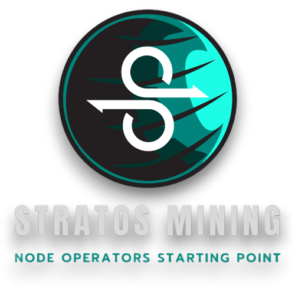

!!! tip "About this page"

    - This is a community operated website and it’s not, in any way, endorsed by the official Stratos project.
    - The content on this website is written from a node operator experience and it's intended to help other node operators in their journey.
    - For any questions, you can find me on the official <a href="https://discord.com/invite/tpQGpC2nMh" target="_blank">Discord</a> or <a href="https://t.me/StratosOfficial" target="_blank">Telegram</a>.

## Quick Start

| Description | Link |
|-------------|------|
| What types of nodes can I run on Stratos Network? | [Link](https://stratosmining.info/stratos-mining-nodes/) |
| What are the requirements for running a Stratos Node? | [Link](https://stratosmining.info/mining-starting-point/) |
| How to setup and run a Stratos Resource Node (SDS)? | [Link](https://stratosmining.info/howto-install-stratos-sds-node/) |
| How to setup and run a Stratos Validator Node (Full-Chain)? | [Link](https://stratosmining.info/howto-install-stratos-full-chain-validator-node/) |

