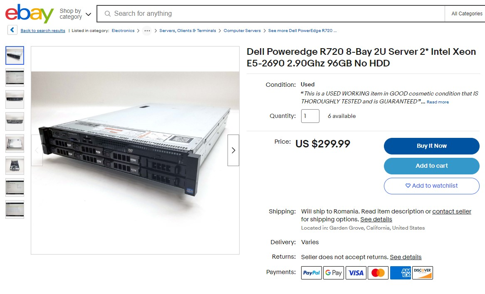
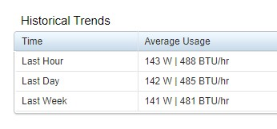

<small> Last update: Dec 14, 2023</small>

!!! tip "DISCLAIMER"

    - This article is NOT part of the official documentation.
    - Think of this as an extended product review written by a fellow node operator after running nodes in mainnet for about two months.
    - Values and predictions used in this article were consistent with the factual circumstances at the time of its writing. If you read this at a much later time, you might get different and unexpected results in regards of incurring costs, rewards amount etc.

## Where to start?

If you're seriously considering running a node in Stratos network but don't know exactly where to start, here a few guidelines you should consider:

- At the time of writing this, the default destination for an uploaded file on Stratos network is **TIER 2**. This means that unless an uploader specifically requests storing the uploaded file on a Tier1 or a Tier3, it will be stored on Tier2 nodes so that's were most of the traffic goes to. If you plan on starting a node, you should start a Tier2, which costs 1600stos to activate. Currently, on other tiers, you will get little to nothing in rewards.

- Internet connection plays a very important role. Before going forward, you should check the connection speed where the node will be running on. Read more at [Connection](#connection).

---

 

## Hardware Requirements

As you probably saw in the official documentation, the requirements for running a node are:

| Type | CPU | RAM | Storage | Bandwidth | Stake |
| ---- | --- | --- | ------- | --------- | ----- |
| TIER 1 | 8 Cores[¹](#), 2.5GHz[²](#) | 16 GB | 4 TB | Up: 50Mbps Down: 100Mbps | 800 STOS |
| TIER 2 | 16 Cores[¹](#), 2.5GHz[²](#) | 32 GB | 8 TB | Up: 100Mbps Down: 100Mbps | 1600 STOS |
| TIER 3 | 32 Cores[¹](#), 2.5GHz[²](#) | 64 GB | 16 TB | Up: 1Gbps Down 1Gbps | 3200 STOS |

- You can run a Stratos node on either a server or a desktop:
    - Server: cheaper but a bit noisy and larger in dimensions.
    - Desktop: more expensive but smaller and quieter.  
- CPU architecture needs to be x86. It won't work on ARM (Apple Macs for example).
- You can get cheaper refurbished / used hardware parts (cpu/ram) off ebay for example. As long as they are tested, there shouldn't be any issues. 
- Never get used HDDs. You don't know how they were used, for how long, at what temperatures etc.

An example of a cheap solution is something similar to this:

It comes with everything except HDDs.

You can buy one or more new HDDs and you're ready to go.

As stated above, the most profitable node is Tier 2 so let's break that down.

---

 

### CPU

As you can see in requirements, you will need a 16 cores cpu with a 2.5GHz base clock. 

You can achieve this in two ways:

- Get a desktop PC with a 16 cores CPU. For example (but not limited to):
    - i7-13700K (16 cores / 3.4 GHz)
    - i9-12900K (16 cores / 3.2 GHz)

- Get a server with dual CPUs. For example (but not limited to):
    - E5-2690 (8 cores / 2.9 GHz)
    - E5-2450 v2 (8 cores / 2.5 GHz)

Currently, the load on the CPU will be minimal so you don't need exotic cooling solutions. 

The reasons behind these CPU requirements are:

1. Seamlessly process uploading / downloading tasks when needed.
2. These nodes will be also used once computation layer is deployed, which will require higher computation power. 

So we're setting up rather high specs from the get-go so we don't have to upgrade them mid-mining.

---

 

### RAM

From my experience, i noticed that a node will like to reserve around 10GB of RAM and actually use around 5-6 GB. 

Adding that to what the OS will be using and leaving some headroom in case it's ever needed, you should be fine with 32GB RAM if you plan to run a single node.

---

 

### Storage

The minimum available space required for a Tier2 is 8 TB (real capacity, not claimed). 

But before that, let's talk redundancy first.

Your node will be storing data which is valuable for your node health. Losing that data in an event of a HDD failure will result in penalties and basically the end of your node. You will need to start over.

Sure, scheduled daily backups to a machine in another location is recommended but if you can't do that, at least try to use a RAID setup.

If we take as example the Dell Poweredge in the image above, that one comes with a H710 raid controller. That controller will use your drives to create a single large virtual drive, at BIOS level. 

So taking advantage of that card, you should consider a setup similar to the following:

- You need to provide at least 8 TB of free space but you also think about redundancy so,
- Get 3x 6TB drives.
- Create a RAID 5 setup using the raid controller card.
- You will now have
    - 2x 6TB drives pooled into one large virtual drive (real-world capacity will be 2x 5.46TB)
    - 1x 6TB drive configured as parity drive. This means that if one of the above drives fails, the data on the parity drive will be used to restore the data of the failed drive.

I know it's appealing to use 3x 4TB drives because by a quick logic, excluding parity, 2x 4TB will result in a 8 TB available space, right? But not really.

Hard drives have a claimed capacity (by the manufacturer) and a real capacity (seen by the operating system). So a (claimed) 4 TB drive will actually provide 3.64 TB real capacity. So you will be presenting the OS a virtual drive of 2x 3.64 TB which is 7.28 TB real capacity. 

And with a tier 2 node having a 8 TB requirement, the node will fail to start. So keep that in mind.

Of course, given the fact that the Dell R720 in the screenshot above provides 8 HDD trays, you can go ahead and buy 8 drives, setup a RAID 5, and have 7 drives providing storage space to your node and you won't have to worry about running out of space anytime soon.

But keep in mind two things: when using a RAID setup, all the drives need to be of **the same capacity**. You can't use different sizes of drives. And second, providing way more storage capacity than the minimum required, won't bring you more rewards. It will just bring peace of mind that you won't be running out of free space anytime soon.

Another thing worth mentioning is the HDD vs SSD topic.

A HDD will have an average writing speed of 80MB/s to 160MB/s which is roughly 640Mbps to 1280Mbps. If your internet connection is, for example 100Mbps, your drive write speed will be bottle-necked at 100Mbps so there's actually no need to use SSDs unless you have an internet connection that can keep up with SSD write speeds (eg. 2Gbps or more).

---

 

### Connection

The internet connection plays a crucial and decisive role regarding your node performance. 

A tier2 has a minimum requirement of 100Mbps upload and download but this is required to any part of the world, not just in your home country. 

So before investing in hardware, please make sure you connection can actually handle a Tier2 node.

To do this, go to <a href="https://speedtest.net" target="_blank">speedtest</a> website and select different servers on different continents to make sure your upload/download isn't lower than 100Mbps to any part of the world. 

As part of the decentralization ideology, you will be receiving files from nodes all over the world, not just from your immediate vicinity. Failing to keep an average speed of 100Mbps will drop the weight (trust) of your node and it will be receiving less and less tasks, which means less and less rewards.

Secondly, the port of the node will need to be accessible for incoming TCP/IP connections from the internet. So, if you have a home network setup where the internet cable connects to a router and all the devices using the internet in your location are assigned LAN IPs (192.168.x.x or 172.16.x.x-172.31.x.x or 10.x.x.x), please make sure you have access to the router's configuration page and port forwarding is available.

In a setup like this, let's say you get a server and connect a lan cable from the router. The router will most likely assign to the server an IP in the form of 192.168.1.20 for example. You will need to open your router configuration and add a port forwarding rule defining that all traffic (TCP/UDP) incoming and outgoing on node's port (default is 18081), will be forwarded to ip 192.168.1.20.

The same rule applies to firewalls that filter traffic. You need to make sure you can properly open (and forward if needed) the node port.

Failing to provide an open port to the node will prevent you from even starting it.

As for static / dynamic IPs, it doesn't mater, you can run a node on either type.

Another thing worth mentioning, the limit for the number of nodes you can run on an IP is 5. So if you have multiple servers on the same network and same IP or just one big powerful server, you can run up to 5 nodes on the same external IP.

---

 

### Power consumption

As stated before, the load on the CPU is minimum so there's no intensive power consumption involved.

I'm also running a Dell Poweredge R720 and this is the average power consumption:

This will help you get an idea and maybe calculate an expected cost for electricity.

---

 

#### Optional: UPS

Having your server connected to an uninterruptible power supply (UPS) is always a good option, even if your electricity connection is stable and only cuts off a few times a year. But you never know when that brutal shutdown will have irreversible effects on your components, especially on your storage drives.

Having an UPS is also good if your electricity cuts off frequently, this will allow you to keep your server running until power comes back on (short cut-offs) but will also allow you to safely shut down your computer if a longer cut-off is expected.

An average UPS will usually have two 9Ah batteries and if the UPS capacity is for example, 1500 VA / 900 W, and the server is using 140W on average, that UPS will last you probably close to an hour of down-time.

---

 

## Expected rewards

As far as rewards go, it's a bit difficult to give a specific number. The rewards you will receive are influenced by a lot of factors, the most important one being your node performance.

If your node has a stable internet connection, low latency, high upload / download speed, no downtime and doesn't lose the previous data saved, it will increase its weight.

The higher weight it has, the more changes to be selected as a destination for a task.

To get a slight idea about possible rewards, know that the protocol releases 48 STOS every ~10 minutes. There are currently 434 nodes (<a href="https://rest.thestratos.org/register/resource-count" target="_blank">check for yourself</a>). 

A simple calculation would be:

48 x 6 x 24 = 6912 stos a day 
divided by 434 nodes = 15 stos a day per node

But based on each individual node performance, the amount could be a bit higher or lower.

Once you start getting rewards, they are added to your wallet as *immature* rewards. After 2030 epochs (at around 10 minutes / epoch, that's 14-15 days time), those rewards become *mature* and can be withdrawn and do whatever you want with them.

---

 

## Costs

So you made up your mind, checked your connection, made sure you can run a tier2 at home or someplace else and you want to start mining. What would be the costs?

If you go for a server, you could probably pick up a refurbished one at around $300.

3x 6TB brand new drives will set you back (depending how deep you dig for the lowest price) around $150 - $200 each so let's say $600. 

Sure, you could go ahead and just buy one 10TB drive for maybe $220 (9.09 TB real capacity) and use that for node storage AND operating system but you will have no redundancy in this setup and if that drive fails and you lose all the data stored by the node, it's game over. You will need to start a new node all over again.

Add electricity cost to the calculation and then factor in the rewards. 

In an ideal scenario when you get 15 STOS / day, so 450 STOS a month, at the current $0.90 price, that's $405 a month. 

Besides the hardware and electricity cost, there's also a 1600 STOS activation fee which is locked up for at least 6 months.

Drawing the line, it's not a bad deal overall. 

Hardware cost - you can resell that at a lower price when you're done mining so you still get part of the cost back.

Activation fee - it's locked up, not paid so you get that back after 6 months if you decide to stop mining (given that your node doesn't act weird during this time and you get slashed (see [penalties](#penalties)).

But you're **potentially** earning like $400 a month which is not bad. 

(At the time of writing.  You could get very different results if you're reading this a year from now.)

---

 

## Penalties

The protocol itself is pretty permissive and doesn't penalize you with every little mistake you make. 

However,

- if your node can't keep an average of 100Mbps upload/download, your weight won't increase past 2080 weight mark and you won't be getting rewards. Basically, you will run a zombie node that doesn't generate anything.

- if your node goes offline for more than 1 hour (power outage, connection drops etc), it gets suspended. This doesn't incur any penalties but you will need to pay 10 STOS in re-activation fee so you will start mining again.

- (soon to be implemented) if your node keeps going offline, each time you re-activate it, the fee will increase exponentially (10, 20, 40, 80 etc) so make sure that doesn't happen.

- (worst case scenario) if your machine suffers a catastrophic failure and you lose all the data, node gets suspended after ~1 hour and gets tombstoned after ~1 week. This means that it will be removed from meta nodes records and all the data stored by your node will be copied from backup nodes to a new node. The cost for that data transfer will be paid out of your 1600 STOS activation fee.

But that isn't as bad as it sounds because:

1. You already generated some rewards by storing that data in the first place.
2. The cost of storage on Stratos network is low anyway. So even if you have stored, let's say 1TB of data and then lost it. The cost of storing 1TB on Stratos network is under $10 so even if you get slashed that amount, you surely had made more than that from rewards.

Bottom line, it's very hard to get your 1600 STOS deposit slashed, unless your node does absolutely everything backwards.

---

 

## Official links

- Official documentation for setting up a node:  <a href="https://docs.thestratos.org/docs-resource-node/setup-and-run-a-sds-resource-node/" target="_blank">https://docs.thestratos.org/...</a>
 
 

- Official Stratos website:  <a href="https://www.thestratos.org/" target="_blank">https://thestratos.org/</a>
 
 

- SDS GitHub releases:  <a href="https://github.com/stratosnet/sds/releases" target="_blank">https://github.com/stratosnet/...</a>
 
 

- Native chain explorer:  <a href="https://explorer.thestratos.org/stratos" target="_blank">https://explorer.thestratos.org/stratos</a>
 
 

- EVM chain explorer:  <a href="https://web3-explorer.thestratos.org/" target="_blank">https://web3-explorer.thestratos.org/</a>
 
 

---

 