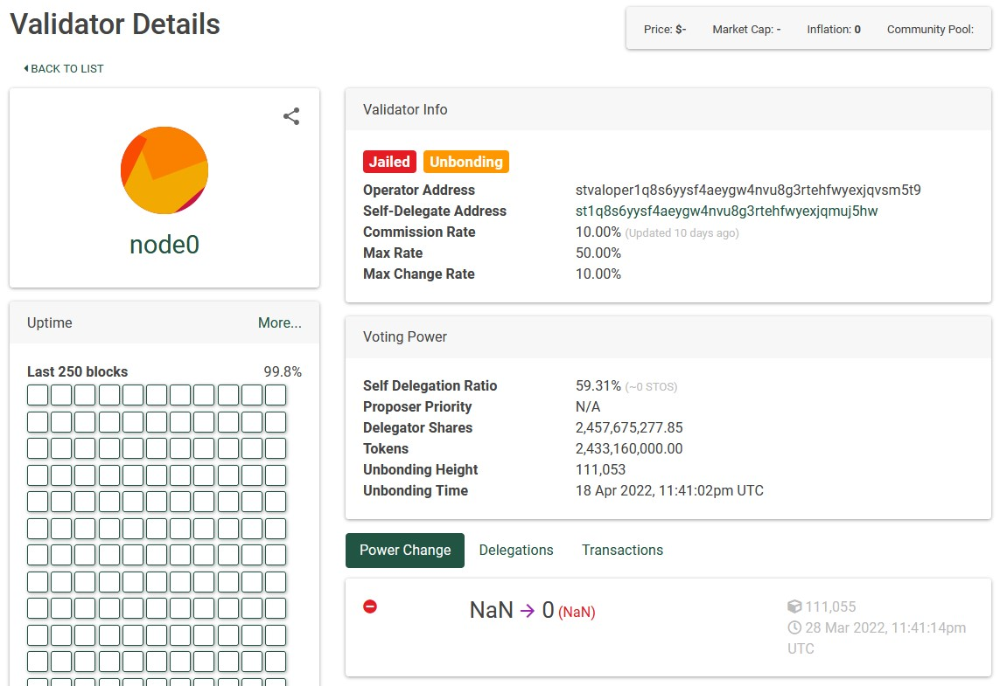
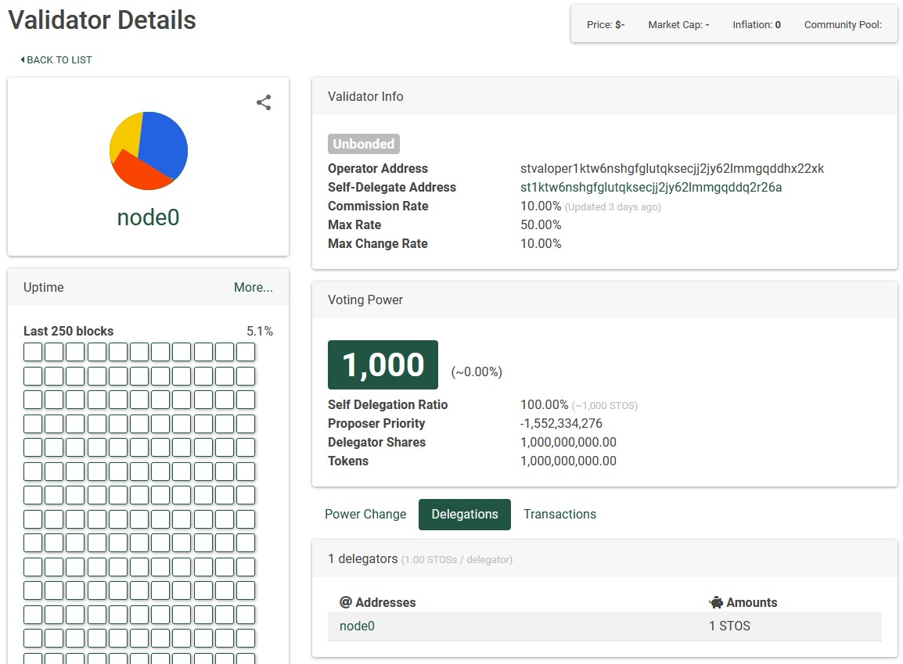

<small> Last update: March 12, 2023</small>

### Jailed Validator

In most cases, a node crashes for different reasons, mostly from the '<a href="https://stratosmining.info/stratos-validator-socket-too-many-open-files/" target="_blank">too many open files limit</a>' error so validator gets jailed for offline time.

If you see your validator in this state in explorer, here's how to fix it.



 

- First and most important thing, open the screen or tmux where your node was running an see _WHY_ your node crashed. If you can't figure it out, you are welcome to join <a href="https://discord.com/invite/tpQGpC2nMh" target="_blank">Discord</a> and we'll try to solve it together.
- Once the issue has been solved, restart your node and wait for it to reach the latest block height.
- When a validator gets jailed, there is a 6 hours cool-down period. Check your validator on the  <a href="https://explorer-tropos.thestratos.org/validators" target="_blank">explorer page</a> like in the screenshot above and look at the date and hour when the **Power Change** switched to zero. Let's take for example, the power change took place at 3:00pm UTC. You will have to wait until 9:00pm UTC before you can run the unjail command. (you can use Google to convert timezones: search for _9pm utc to my time_ to see exactly how much time you have to wait.)
- Once your node is running, has synced to latest block height and 6 hours have passed since you got jailed, you can run this command:

```
stchaind tx slashing unjail --from st1xxx --chain-id=tropos-5 --keyring-backend=test --gas=auto --gas-prices=1000000000wei
```

Replace st1xxx with your wallet (shown in your validator page under **Self-Delegate Address**)

 

### Unbonded Validator (but not Jailed)

If you see your validator in this state, it's most likely because you don't have enough tokens delegated to your node.



- Open your node in explorer and check how many tokens you have delegated to it from the **Delegations** tab as shown in the above image.
- Now open the <a href="https://explorer-tropos.thestratos.org/validators" target="_blank">validators page</a>, sort them by voting power and open the validator on place 100 (that has lowest voting power) and look at its **Delegations** tab. If that validator has more tokens delegated than your validator, you have to delegate more tokens than him to take his place.
- To delegate more tokens for you node, use this command:

```
stchaind tx staking delegate stvaloper1xxx 10stos \
--from st1xxx \
--chain-id=tropos-5 \
--keyring-backend=test \
--gas-prices=1000000000wei
```


- Replace stvaloper1xxx with your node operator address

- Replace st1xxx with your wallet address (shown as Self-Delegate Address in the above image)


Once you have delegated more tokens to your validator than the validator on place 100, you should take its place and become an active validator yourself.
