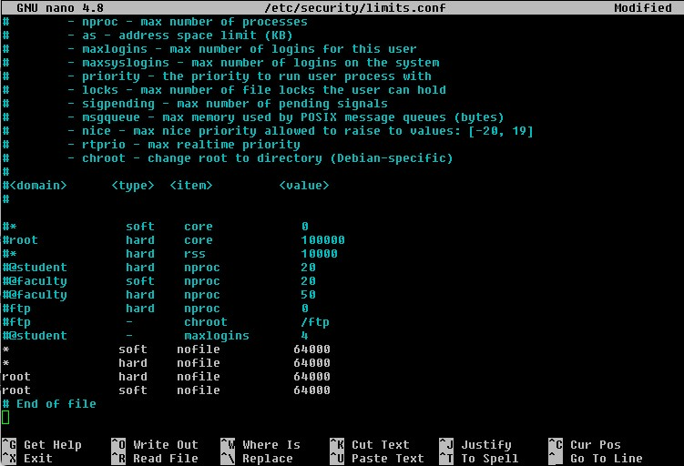

<small> Last update: March 12, 2023</small>

A lot of node operators, especially full-chain validator operators, that are running a node on a default Ubuntu installation, will come across this error sooner or later:

!!! failure ""
	    E[2023-02-23|20:28:56.724] dialing failed (attempts: 12): dial tcp xx.xx.xx.xx:26656: socket: too many open files module=pex addr=2edd3108c3b2ab34fd43ff7177fabde7db8942cd@xx.xx.xx.xx:26656
	    E[2023-02-23|20:28:56.724] dialing failed (attempts: 13): dial tcp xx.xx.xx.xx:26656: socket: too many open files module=pex addr=9d1e802eff08308161c0e4d4e6dc8aad419a1705@xx.xx.xx.xx:26656
	    E[2023-02-23|20:28:58.985] Accept on transport errored                  module=p2p err="accept tcp [::]:26656: accept4: too many open files" numPeers=54
	    panic: open /home/user/.stchaind/data/blockstore.db/02472.ldb: too many open files
	    panic: accept routine exited: accept tcp [::]:26656: accept4: too many open files

This is caused by the limit set by default in Ubuntu (and probably other distributions as well).

Check it with:
```
ulimit -Sn
```

If you see a value close to **1024**, you have to increase the limit so the validator can run smoothly. To increase it to 64000. Open this file:

```
sudo nano /etc/security/limits.conf
```

add the following lines at the end of the file (but before # End of file so it looks nice)

```

*		hard	nofile		64000
*		soft	nofile		64000
```

if you're running things as root (which is not recommended btw, you should always login as regular user and use **sudo** when you need to run superuser commands), add these lines too:

```
root		hard	nofile		64000
root		soft	nofile		64000
```

This is how your file is supposed to look:



Exit terminal and re-login through SSH or just reboot your server to be sure.

Alternatively, you could simulate a new login and reload the environment with this command. your-server-username is the name you use to login to your linux server.


```
su – your-server-username
ulimit -Sn
```

The value printed now should be 64000. If it's still 1024 or 4028, try to reboot your server. Your node shouldn't be crashing anymore from that error.