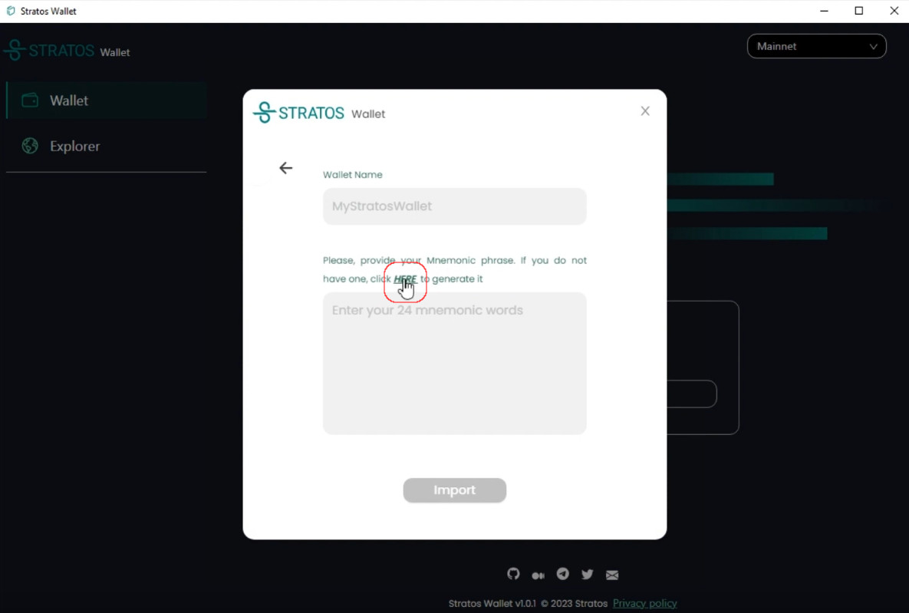
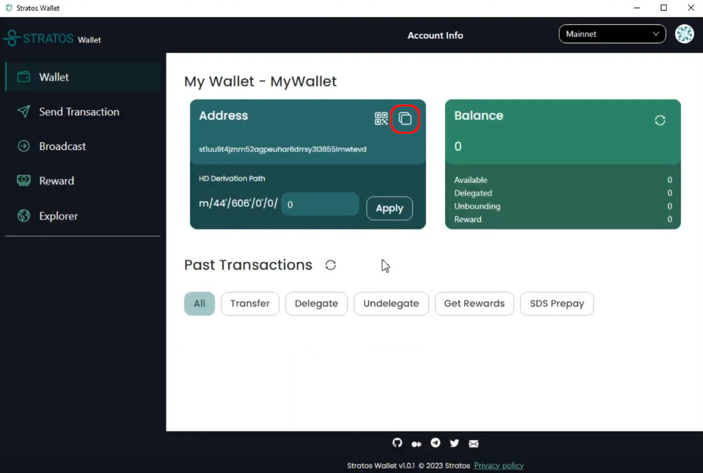
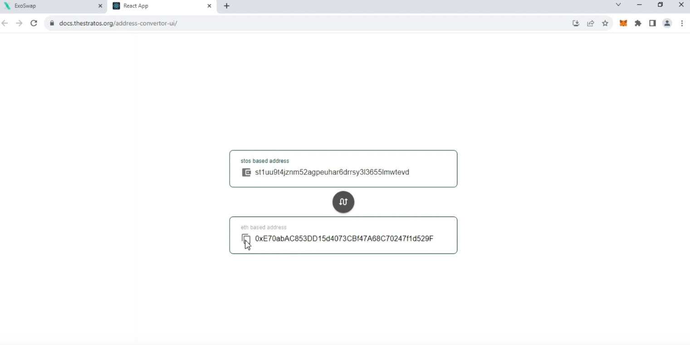
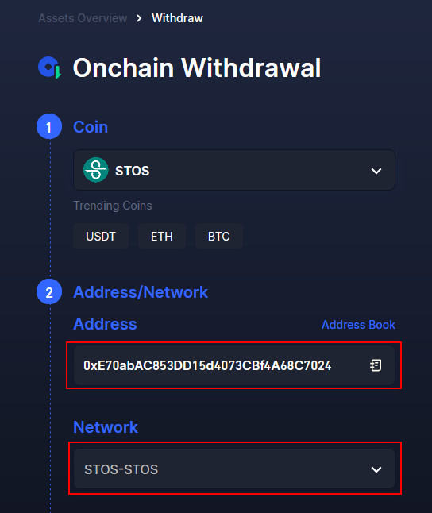
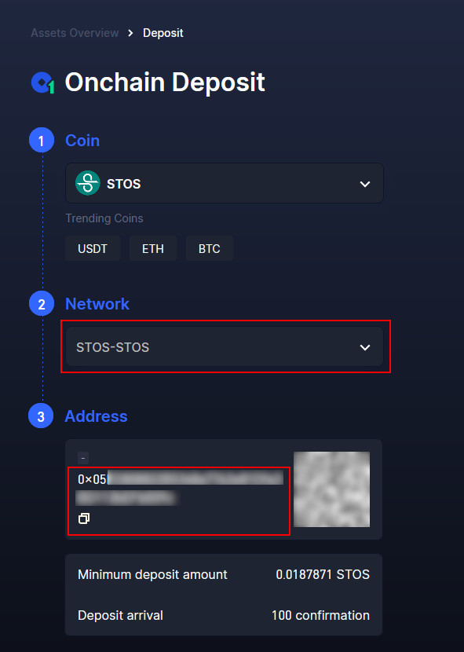
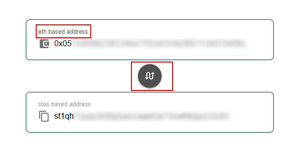
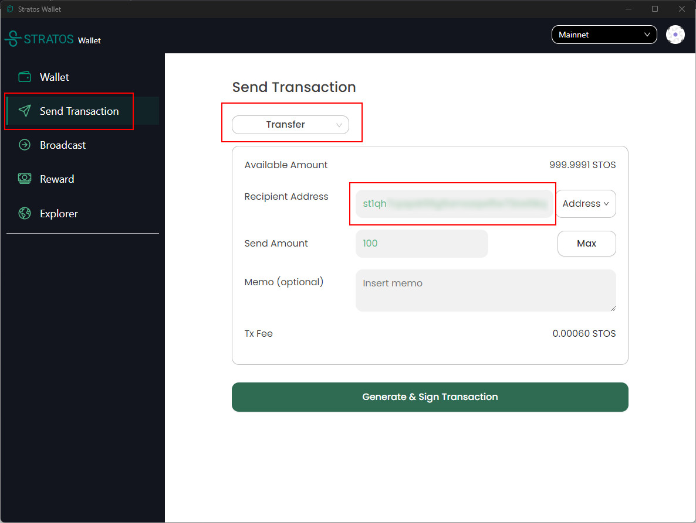

## Introduction

There are two ways to move STOS token from/to Ethereum network and Stratos Mainnet:

1. Using the ExoSwap bridge (<a href="https://docs.thestratos.org/docs-stratos-chain/mainnet-bridge-and-staking/" target="_blank">tutorial here</a>)

	Advantages:

	- Fully decentralized.
	- You only need to have STOS in a Metamask wallet as ERC20 and some ETH for gas fee.
	- Bridge from Ethereum to Stratos will cost base eth gas fee + 1 STOS.

	Disadvantages:

	- Bridge from Stratos to Ethereum will cost 60-70 STOS.

2. Using Gate.io

	Advantages:

	- Cheap fees (Stratos to Ethereum: Less than 1 STOS, Ethereum to Stratos: 3 STOS).

	Disadvantages:

	- Partially centralized.
	- You will need a working and KYC'ed Gate.io account.

!!! tip

	- Always send a small test transaction first to make sure everything is working properly.

	- When sending from Gate to Stratos Chain, as an extra check, make sure Gate's <a href="https://web3-explorer.thestratos.org/address/0x0D0707963952f2fBA59dD06f2b425ace40b492Fe" target="_blank">hot wallet</a> on Stratos Chain has enough tokens to process your withdrawal amount (has more than your requested amount).

	- If you're not sure about any of the steps, please ask for assistance on Telegram or Discord (links at the bottom of the page).

 

---

## From Gate.io to Stratos Network

- <a href="https://www.thestratos.org/stratos-network-wallet" target="_blank">Download</a> the latest version of the Stratos Wallet. If you already have the Stratos Wallet installed a long time ago, please uninstall it and get the latest version.

- Import an existing wallet address or generate a new one. To generate a new one, click `Import` and the click `Here` button to generate a new mnemonic phrase.

- Copy the wallet address in the st1ABC format by clicking the copy button.

- Open the <a href="https://docs.thestratos.org/address-convertor-ui/" target="_blank">Address Convertor Page</a> and Paste the st1xxx format address in the `stos based address` field.

Next, copy the translated address in the 0xABC form.

- Go to your Gate.io account, <a href="https://www.gate.io/myaccount/withdraw/STOS" target="_blank">Onchain Withdrawal</a> and select STOS as coin.

- Enter the resulting 0x wallet address from Convertor Page and select STOS-STOS as network:

- You will receive STOS directly to your Stratos Wallet address.

 

---

## From Stratos Network to Gate.io

- Go to your Gate.io account, <a href="https://www.gate.io/myaccount/deposit/STOS" target="_blank">Onchain Deposit</a> and select STOS as coin.

- Select STOS-STOS as network and copy the 0x wallet address:

- Go to <a href="https://docs.thestratos.org/address-convertor-ui/" target="_blank">conversion UI</a> page and convert the 0x deposit address to st1 format. Make sure you switch the order by clicking the middle button and that `eth based address` is first.

- Copy the st1 address and open Stratos Wallet. Go to Send Transaction, Select Transfer as the transaction type and insert the resulting st1 wallet address.

 

- You will receive STOS directly to your Gate.io account.

---

 