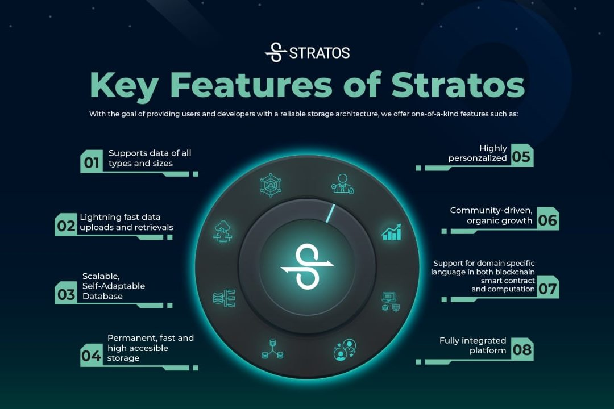

## Introduction

Stratos is a distributed infrastructure network that offers a three-in-one resource package:
!!! info ""
    - Storage
    - Computation
    - Database

Stratos' decentralized storage and decentralized database offer rapid storing and querying services for various types of data. Whether the data is structured or unstructured, the Stratos data mesh processes it in distinct ways, based on the type of data, for example, by accelerating data queries and video playback.

This eliminates the need for complicated network deployment, allowing community developers to publish their systems effortlessly. As a result, developers can concentrate entirely on their product's business logic without being concerned about the underlying infrastructure, resulting in more effective development and operation and reduced costs.

Stratos guarantees an indestructible environment for all dApps, ensuring that no one can take down your application.

  

## Stratos Data Mesh

Stratos' Decentralized Data Mesh defines the future of decentralized computing services that can serve decentralized applications, allowing smart contract deployers to use decentralized infrastructure to deploy, store and execute their code and data.

As we’re heading to Web 3.0, an open, trustless and permissionless network, Stratos strives to build a fundamental service to support the adoption of blockchain in Web 3.0, which helps create more intelligent, connected, and open websites.

Key features of Stratos Data Mesh:

!!! info ""
    - Support data of all types and sizes
    - Lightning fast data upload and retrieval
    - Scalable, self-adapt database
    - Permanent, accelerated, high availability storage
    - Community-driven, organic growth
    - Support for domain-specific language in both blockchain smart contract and computation
    - Fully integrated platform

The Stratos Data Mesh is comprised of 4 modules and 3 layers. 

Each layer uses a different consensus algorithm.

!!! info "Modules"
    - Blockchain
    - Decentralized storage
    - Decentralized computing
    - Decentralized database

!!! info "Layers"
    - Value layer - uses Proof-of-Stake (PoS)
    - Resource layer - uses Proof-of-Traffic (PoT)
    - Meta layer - uses Proof-of-Authority (PoA)

### Stratos Blockchain

The Stratos blockchain collects and verifies each task performed in the resource node of each data center, records the usage of specific computing modules, database modules, and storage modules, and then writes to the chain after the consensus process. 

The service provider receives the Stratos token (STOS) directly which is calculated by the smart contracts. Users of data mesh will directly pay Stratos Token (STOS) based on usage of resources.

!!! info ""
    - Provides workload calculation and settlement of the resources layer  
    - Provides digital currency payment  
    - Provides storage content verification
    - Uses the Practical Byzantine fault-tolerant consensus algorithm

### Stratos Resource Layer

The resource node is the foundation of the decentralized computing and storage network. 

Generally, a resource node is a general-purpose computing server that has ample computing power, network traffic, and storage resources. 

Along with fundamental support capabilities such as communication, encryption, file system, and database, resource nodes will also serve as a general computing platform, providing diverse application-oriented functional calling interfaces. 

!!! info ""
    - Provides storage services  
    - Provides computing services  
    - Provides customized PaaS and SaaS services

### Stratos Meta Layer

The meta nodes are deployed independent from the resource nodes. 

The meta node is mainly responsible for:

!!! info ""
    - Statistics of computing power, network traffic and storage resources
    - Indexing the resources located on the resource nodes
    - Routing service for accessing the content on the resource nodes
    - Analyze computing task demands, allocate the computing power, network traffic and storage of corresponding resource nodes to meet corresponding requirements intelligently
    - Balance the storage and traffic in the resource network
    - Make sure the slice replication number for each file and the accessibility of files in the resource network
    - Dynamically expand/shrink the resource allocation

### STOS Token

STOS is Stratos Token, the native token facilitating value circulation in the Stratos Ecosystem.

!!! info ""
    - STOS will be staked/delegated to validators to secure the Blockchain network.
    - STOS will be issued as Proof-of-Traffic mining reward.
    - STOS will be consumed in the payment of the transaction fee.
    - STOS will be prepaid for Stratos Resource Network service traffic fee.

## Stratos Use Cases

Most applications use computing power, database and storage so the possible use cases for Stratos are pretty much endless.

As an example, we can list a few applications (but not limited to):

!!! info ""
    - Decentralized video and music streaming (Stratos Storage)
    - Decentralized digital (NFT) market (Stratos Blockchain and Storage)
    - Decentralized social network (Stratos Database)
    - Decentralized machine learning, product design, data analysis, forecasting, etc (Stratos Computation)
    

